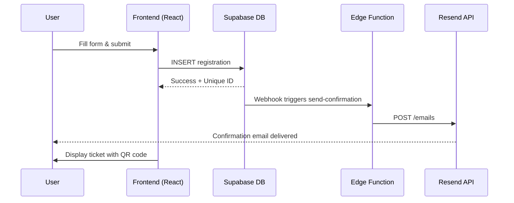
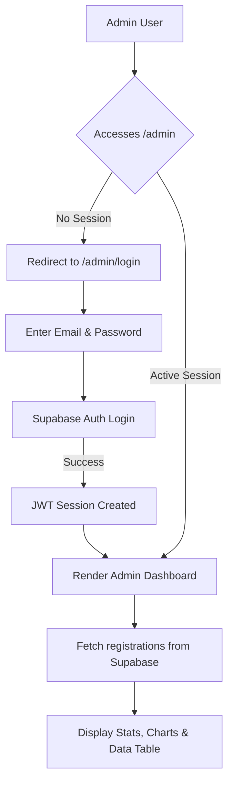

# µPhoria Tech Fest — Event Landing Page & Registration System


**Author:** Dhaniyal Jose

## Overview
µPhoria Tech Fest is a premium, full-stack event landing page and registration system built with React + Vite. It features a dark-mode glassmorphic UI, dynamic animations, 3D interactive registration form, real-time Supabase integration, a secure admin dashboard, and automated email notifications via Resend.

---

## Key Features

### Public Landing Page
- **Hero Section:** Full-width looping background video with a blurred glassmorphism overlay and countdown timer.
- **About Section:** Three-column feature grid highlighting curriculum topics.
- **Speakers Section:** Speaker cards with grayscale-to-color hover effects and social links (LinkedIn, Twitter, GitHub).
- **Schedule Section:** Day-wise tabbed timeline powered by Framer Motion animations.
- **FAQ Section:** Smooth accordion with CSS-powered expand/collapse transitions.
- **Location Section:** Embedded Google Map (dark mode via CSS filters) with venue and contact details.

### Registration System
- **3D Dynamic Form:** Framer Motion tilt effects that respond to mouse movement for a premium interactive feel.
- **Form Validation:** Proper input validation, duplicate email prevention, and capacity limit checks (max 500 attendees).
- **Success Flow:** Generates a unique Registration ID (e.g., `EVT-A3B9XZ`) and displays a QR code on successful submission.
- **Digital Ticket:** Downloadable ticket as PNG or PDF with QR code.

### Admin Dashboard (`/admin`)
- **Secure Login:** Email/password authentication via Supabase Auth.
- **Analytics Overview:** Total registrations, attended users, and weekly growth stats.
- **Registration Trends Chart:** Interactive area chart built with Recharts.
- **Data Table:** Searchable and filterable list of all registrations.
- **Actions:** Export CSV, delete entries, and toggle attendance status.

### Email Notifications (Supabase Edge Functions)
- **Confirmation Email:** Automatically sent via Resend API when a new user registers (triggered by a Supabase Database Webhook).
- **Event Reminder:** Scheduled batch email sent 1 day before the event to all registered attendees.

---

## Tech Stack

| Layer | Technology |
|-------|-----------|
| **Frontend** | React 19, Vite 7, React Router DOM |
| **Styling** | Vanilla CSS (CSS Variables, Glassmorphism, Keyframe Animations) |
| **Animations** | Framer Motion |
| **Icons** | Lucide React |
| **Charts** | Recharts |
| **QR Codes** | qrcode.react |
| **Ticket Export** | html2canvas, jsPDF |
| **Backend** | Supabase (PostgreSQL + Auth + Edge Functions) |
| **Email** | Resend API |

---

## Architecture

### User Registration Flow


### Admin Authentication Flow


---

## Project Structure
```
uphoria-tech-fest/
├── public/
├── src/
│   ├── assets/            # Images and static assets
│   ├── components/        # Reusable UI components (Hero, Speakers, FAQ, etc.)
│   ├── pages/             # Page-level components (Home, Events, Admin)
│   ├── App.jsx            # Main app with routing
│   ├── App.css            # App-level styles
│   ├── index.css          # Global styles & design tokens
│   ├── main.jsx           # Entry point
│   └── supabaseClient.js  # Supabase client configuration
├── supabase/
│   └── functions/
│       ├── send-confirmation/index.ts    # Edge Function: confirmation email
│       └── send-event-reminder/index.ts  # Edge Function: reminder email
├── .env.example           # Environment variable template
├── index.html             # HTML entry point
├── vite.config.js         # Vite configuration
└── package.json
```

---

## Setup & Local Development

### Prerequisites
- Node.js 18+
- A [Supabase](https://supabase.com) project
- A [Resend](https://resend.com) account (free tier)

### Installation
```bash
# 1. Clone the repository
git clone https://github.com/Dhaniyal-Jose/-Phoria-Tech-Fest.git
cd -Phoria-Tech-Fest

# 2. Install dependencies
npm install

# 3. Create your .env file
cp .env.example .env
# Edit .env and add your Supabase URL and anon key

# 4. Start the dev server
npm run dev
```

### Supabase Setup
1. Create a new Supabase project.
2. Go to **SQL Editor** and run the SQL from `supabase_schema.sql` to create the `registrations` table.
3. Go to **Authentication → Users** and create an admin user.
4. Copy your **Project URL** and **anon key** from **Settings → API** into `.env`.

### Edge Function Deployment (Optional)
To enable email notifications, deploy the Edge Functions to your Supabase project:
```bash
supabase functions deploy send-confirmation
supabase functions deploy send-event-reminder
```
Set the Resend API key as a secret:
```bash
supabase secrets set RESEND_API_KEY=re_your_api_key_here
```

---

## Environment Variables
```env
VITE_SUPABASE_URL=https://your-project.supabase.co
VITE_SUPABASE_ANON_KEY=your-anon-key
```

---

## License
This project is open source and available under the [MIT License](LICENSE).
